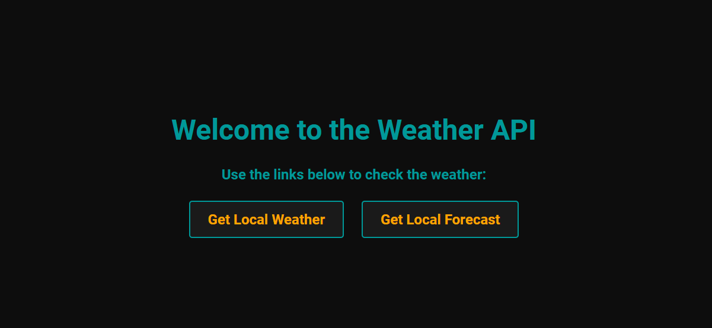
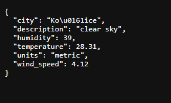
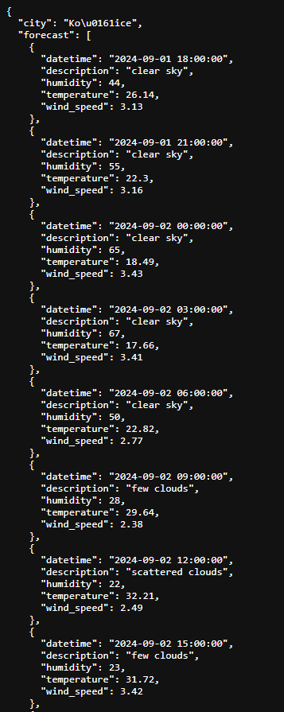

# 🌦️ The Greatest Weather App 🌍

Welcome to **The Greatest Weather App**, a versatile weather forecasting tool that provides accurate weather information based on your location or any city you choose! Built with Python and enhanced with a sleek, dark-themed UI using Material-UI.



## 🚀 Features

- **Location-Based Weather**: Automatically fetches weather data based on your current location using geolocation. 🌍
- **Custom Location Input**: Allows you to manually enter a city and country to get the weather information you need. 🌐
- **Dark Themed UI**: A modern, sleek, and minimalistic design with a dark theme and vivid colors. 🎨
- **Material-UI Enhanced**: Leveraging Material-UI for a smooth and responsive user experience. 🖱️
- **Real-Time Updates**: Get the latest weather updates in real-time for any location. ⏱️
- **Hourly Forecast**: View the weather forecast hour by hour to plan your day better. 🕒

## 🌐 Language Translation Screenshots

### Default Location (Using Geolocation)


### Hourly Forecast


## 🛠️ Installation

1. **Clone the repository**:
   ```bash
   git clone https://github.com/Antot-12/the-greatest-weather-app.git
   cd the-greatest-weather-app
   ```

2. **Install the dependencies**:
   ```bash
   pip install -r requirements.txt
   ```

3. **Run the application**:
   ```bash
   python main.py
   ```

## 💻 Usage

### Automatic Location Weather

1. Open the application, and by default, it will automatically fetch your current location and display the weather information. 🌍

### Custom Location Weather

1. Enter a city and country in the provided input fields.
2. Click the "Get Weather" button to fetch the weather information for the specified location. 🌐

### Hourly Forecast

1. After fetching the weather, switch to the "Hourly Forecast" tab.
2. View detailed weather predictions for each hour of the day. 🕒
